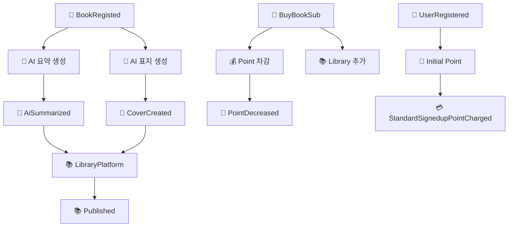

# 📚 KT 걷다가서재 - AI 기반 자동 출간 및 구독 플랫폼

> 클라우드 네이티브 기반 전자책 자동 출간 및 구독 플랫폼  
> Spring Boot + React + Azure + Kafka 기반 마이크로서비스 프로젝트

---

## 🛠️ 프로젝트 개요

- 작가가 글을 작성하면 AI가 자동으로 표지 이미지를 생성하고 전자책으로 출간
- 구독자는 월정액으로 책을 열람하고, KT 고객은 포인트 혜택을 받을 수 있음
- 3회 이상 열람된 도서는 '베스트셀러'로 분류되어 추가 노출
- 실습 목표: 클라우드 네이티브 앱 개발 및 MSA 아키텍처 경험

---

## 📆 개발 기간

- **2025.06.25 (수) ~ 2025.07.04 (금)** / 총 8일

---

## 👥 팀원 (AI_04반_11조)

| 이름   | 역할             |담당 파트
|--------|------------------|------------------|
| 이헌준 | 조장              | 전체 관리 및 PM |
| 김시훈 | 발표자 | AI 출간 자동화 담당 |
| 안도형 | PPT | 구독자 관리 |
| 박수연 | PPT | 서재 플랫폼 |
| 오현종 | 검토 | 집필 관리  |
| 양성현 | 검토 | 포인트 관리 |
| 김민서 | 검토 | 작가 관리  |
| 류근우 | 서기              | 전체 관리 및 연결 진행 |

---

## 🗂️ 주요 일정 및 작업

- **1일차 (06.25)**: OT, 도메인 이해, 역할 분담, User Story, Event Storming
- **2일차 (06.26)**: 전략/전술 설계, 헥사고날 다이어그램
- **3일차 (06.27)**: 마이크로서비스 구현 시작 (Event 기반)
- **4일차 (06.30)**: Kafka 메시징, CQRS, 테스트 작성
- **5일차 (07.01)**: 프론트엔드 구현, Docker 이미지 생성 및 Push
- **6일차 (07.02)**: Azure 배포, 오케스트레이션(HPA, 무정지 배포)
- **7일차 (07.03)**: 서비스 메시 적용, 모니터링 & 로깅
- **8일차 (07.04)**: 배포 파이프라인 설계, Wrap-up, 발표

---

# 📚 소스코드 설명

---

## 🤖 AI Service

### 📝 AI 요약 생성 (ContentAnalyzer)
| 항목 | 내용 |
|------|------|
| **트리거** | `BookRegisted` 이벤트 수신 |
| **처리** | GPT를 활용한 콘텐츠 요약 + 장르 분류 |
| **발행** | `AiSummarized` 이벤트 |
| **핵심 로직** | 중복 처리 방지, 2단계 AI 처리 (요약 → 분류) |

```java
// 🔄 AI 요약 생성 - 2단계 처리
String initialSummary = gptService.generateSummary(
    bookRegisted.getContext(), 500, "KO", "일반요약"
);
String classifiedGenre = gptService.classifyGenre(
    bookRegisted.getTitle(), initialSummary
);

// 📤 이벤트 발행
AiSummarized aiSummarized = new AiSummarized(contentAnalyzer);
aiSummarized.publishAfterCommit();
```

### 🎨 AI 표지 생성 (CoverDesign)
| 항목 | 내용 |
|------|------|
| **트리거** | REST API 요청 또는 `AiSummarized` 이벤트 |
| **처리** | DALL-E를 활용한 표지 이미지 생성 |
| **발행** | `CoverCreated` 이벤트 |
| **핵심 로직** | 요약 결과 활용으로 고품질 표지 생성 |

```java
// 🎨 AI 표지 생성
DalleService dalleService = new DalleService();
String imageUrl = dalleService.generateCoverImage(title, context);

// 🔍 요약 결과 활용한 고품질 표지 생성
String contextForImage = analyzer.getSummary() != null ? 
    analyzer.getSummary() : analyzer.getContext();

// 📤 이벤트 발행
CoverCreated coverCreated = new CoverCreated(coverDesign);
coverCreated.publishAfterCommit();
```

### 🔄 이벤트 오케스트레이션 (PolicyHandler)
| 항목 | 내용 |
|------|------|
| **트리거** | Kafka 이벤트 스트림 수신 |
| **처리** | 이벤트 기반 순차 처리 및 중복 방지 |
| **핵심 로직** | 중복 처리 방지, 순차 실행, 품질 개선 처리 |

```java
// 📚 BookRegisted 이벤트 처리 - 순차적 AI 처리
@StreamListener(condition = "headers['type']=='BookRegisted'")
public void wheneverBookRegisted_ProcessSequentially(@Payload BookRegisted bookRegisted) {
    // 🚫 중복 처리 방지
    if (contentAnalysisExists && coverExists) {
        return;
    }
    
    // ⚡ 순차적 AI 처리
    ContentAnalyzer.aiSummarize(event);
    CoverDesign.autoCoverGeneratePolicy(event);
}
```

---

## 👤 AuthorManage Service

### ✅ 작가 승인 처리 (Author Aggregate)
| 항목 | 내용 |
|------|------|
| **트리거** | 관리자의 `등록 승인` 커맨드 |
| **처리** | 작가 승인 상태 업데이트 |
| **발행** | `AuthorApproved` 이벤트 |
| **핵심 로직** | 관리자 승인 워크플로우, 작가 상태 관리 |

```java
// ✅ 작가 승인 이벤트 발행
AuthorApproved authorApproved = new AuthorApproved(author);
authorApproved.setAuthorId(author.getAuthorId());
authorApproved.setIsApproved(true);
```

**📋 AuthorApproved 이벤트 구조**
```java
@Data
public class AuthorApproved extends AbstractEvent {
    private Long authorId;      // 👤 작가 ID
    private Boolean isApproved; // ✅ 승인 상태
    private String name;        // 📝 작가 이름
}
```

---

## ✍️ WriteManage Service

### 📖 책 등록 처리 (Writing Aggregate)
| 항목 | 내용 |
|------|------|
| **트리거** | 작가의 `책 등록` 커맨드 |
| **처리** | 책 정보 저장 및 등록 상태 설정 |
| **발행** | `BookRegisted` 이벤트 |
| **핵심 로직** | 작가 인증 후 책 등록, 글 작성/수정/삭제 관리 |

```java
// 📖 책 등록 이벤트 발행
BookRegisted bookRegisted = new BookRegisted(writing);
bookRegisted.setBookId(writing.getBookId());
bookRegisted.setTitle(writing.getTitle());
bookRegisted.setRegistration(true);
```

**📋 BookRegisted 이벤트 구조**
```java
@Data
public class BookRegisted extends AbstractEvent {
    private Long bookId;        // 📚 책 ID
    private String context;     // 📝 책 내용
    private Long authorId;      // 👤 작가 ID
    private String title;       // 📖 책 제목
    private Boolean registration; // ✅ 등록 상태
}
```

---

## 👥 SubscribeManage Service

### 🔐 사용자 등록 처리 (User Aggregate)
| 항목 | 내용 |
|------|------|
| **트리거** | 사용자의 `회원가입` 커맨드 |
| **처리** | 사용자 정보 저장 및 등록 상태 설정 |
| **발행** | `UserRegistered` 이벤트 |

### 📝 사용자 정보 수정 처리
| 항목 | 내용 |
|------|------|
| **트리거** | 사용자의 `회원정보수정` 커맨드 |
| **처리** | 사용자 정보 업데이트 |
| **발행** | `UserUpdated` 이벤트 |

### 💎 구독 서비스 가입 처리
| 항목 | 내용 |
|------|------|
| **트리거** | 사용자의 `구독가입` 커맨드 |
| **처리** | 월 구독 상태 활성화 |
| **발행** | `BookServiceSubscribed` 이벤트 |

### 🛒 개별 책 구매 처리
| 항목 | 내용 |
|------|------|
| **트리거** | 사용자의 `소장` 커맨드 |
| **처리** | 포인트 차감 및 책 소장 권한 부여 |
| **발행** | `BuyBookSub` 이벤트 |

**📋 주요 이벤트 구조**
```java
// 👤 사용자 등록
@Data
public class UserRegistered extends AbstractEvent {
    private Long userId;    // 👤 사용자 ID
    private String isKt;    // 📱 KT 계정 여부
}

// 💎 구독 서비스 가입
@Data
public class BookServiceSubscribed extends AbstractEvent {
    private Long userId;           // 👤 사용자 ID
    private String isSubscribe;    // 💎 구독 상태
}

// 🛒 개별 책 구매
@Data
public class BuyBookSub extends AbstractEvent {
    private Long userId;    // 👤 사용자 ID
    private Long bookId;    // 📚 책 ID
}
```

---

## 💰 Point Service

### 🔄 이벤트 처리 정책 (PolicyHandler)

```java
@Service
@Transactional
public class PolicyHandler {
    
    // 🛒 개별 책 구매 시 포인트 차감
    @StreamListener(condition = "headers['type']=='BuyBookSub'")
    public void wheneverBuyBookSub_PointDecrease(@Payload BuyBookSub buyBookSub) {
        Point.pointDecrease(event);
    }

    // 💎 구독 서비스 가입 시 포인트 차감
    @StreamListener(condition = "headers['type']=='BookServiceSubscribed'")
    public void wheneverBookServiceSubscribed_PointDecrease(@Payload BookServiceSubscribed bookServiceSubscribed) {
        Point.pointDecrease(event);
    }

    // 🎁 신규 회원 가입 시 초기 포인트 지급
    @StreamListener(condition = "headers['type']=='UserRegistered'")
    public void wheneverUserRegistered_InitialPointPolicy(@Payload UserRegistered userRegistered) {
        Point.initialPointPolicy(event);
    }

    // 📱 KT 계정 연동 시 추가 포인트 지급
    @StreamListener(condition = "headers['type']=='UserUpdated'")
    public void wheneverUserUpdated_KtSignedupPointPolicy(@Payload UserUpdated userUpdated) {
        Point.ktSignedupPointPolicy(event);
    }
}
```

**📋 발행하는 이벤트 구조**
```java
// 💸 포인트 차감 완료 이벤트
@Data
public class PointDecreased extends AbstractEvent {
    private Long userId;            // 👤 사용자 ID
    private Integer pointBalance;   // 💰 차감 후 잔액
}

// 💳 포인트 충전 완료 이벤트
@Data
public class PointRecharged extends AbstractEvent {
    private Long userId;            // 👤 사용자 ID
    private Integer pointBalance;   // 💰 충전 후 잔액
}

// 📱 KT 가입 혜택 포인트 지급
@Data
public class KtSignedupPointCharged extends AbstractEvent {
    private Long userId;            // 👤 사용자 ID
    private Integer pointBalance;   // 💰 지급 후 잔액
}

// 🎁 일반 가입 혜택 포인트 지급
@Data
public class StandardSignedupPointCharged extends AbstractEvent {
    private Long userId;            // 👤 사용자 ID
    private Integer pointBalance;   // 💰 지급 후 잔액
}
```

---

## 📚 LibraryPlatform Service

### 🔄 이벤트 조합 처리 (Event Orchestration)

```java
@Service
@Transactional
public class PolicyHandler {
    
    // 🗂️ 임시 저장소: bookId 기준으로 이벤트 매칭
    private Map<Long, AiSummarized> aiSummarizedMap = new ConcurrentHashMap<>();
    private Map<Long, CoverCreated> coverCreatedMap = new ConcurrentHashMap<>();

    // 📝 AI 요약 완료 이벤트 수신 및 임시 저장
    @StreamListener(condition = "headers['type']=='AiSummarized'")
    public void wheneverAiSummarized(@Payload AiSummarized aiSummarized) {
        Long bookId = aiSummarized.getBookId();
        aiSummarizedMap.put(bookId, aiSummarized);
        publishIfReady(bookId);
    }

    // 🎨 AI 표지 생성 완료 이벤트 수신 및 임시 저장
    @StreamListener(condition = "headers['type']=='CoverCreated'")
    public void wheneverCoverCreated(@Payload CoverCreated coverCreated) {
        Long bookId = coverCreated.getBookId();
        coverCreatedMap.put(bookId, coverCreated);
        publishIfReady(bookId);
    }

    // ✅ 두 이벤트가 모두 수신되면 출간된 도서 정보 발행
    private void publishIfReady(Long bookId) {
        AiSummarized aiEvent = aiSummarizedMap.get(bookId);
        CoverCreated coverEvent = coverCreatedMap.get(bookId);

        if (aiEvent != null && coverEvent != null) {
            LibraryInfo.publish(aiEvent, coverEvent); // 📚 출간된 도서 정보 발행
            aiSummarizedMap.remove(bookId);
            coverCreatedMap.remove(bookId);
        }
    }
}
```

**📋 발행하는 이벤트 구조**
```java
// 📚 도서 출간 완료 이벤트
@Data
public class Published extends AbstractEvent {
    private Long bookId;             // 📚 도서 ID
    private Long authorId;           // 👤 작가 ID
    private String authorName;       // 📝 작가명
    private String title;            // 📖 도서 제목
    private String imageUrl;         // 🎨 AI 생성 표지 URL
    private String summary;          // 📝 AI 생성 요약
    private String context;          // 📄 도서 내용
    private String classificationType; // 🏷️ AI 분류 장르
    private Date publishDate;        // 📅 출간일
    private Long selectCount;        // 📊 선택(구매) 횟수
    private Integer rank;            // 🏆 랭킹
    private Boolean bestseller;      // ⭐ 베스트셀러 여부
}

// 🏆 베스트셀러 선정 이벤트
@Data
public class BestsellerGiven extends AbstractEvent {
    // ... Published와 동일한 구조
    private Boolean bestseller;      // ⭐ 베스트셀러 여부 (true)
}
```

---

## 🎯 비즈니스 가치

### 🤖 AI Service
- **자동화된 콘텐츠 처리**: 책 등록 시 AI 요약 및 표지 자동 생성
- **중복 처리 방지**: 불필요한 AI API 호출 및 비용 절약
- **품질 최적화**: 요약 결과를 활용한 고품질 표지 생성

### 👥 SubscribeManage Service
- **구독 모델**: 월 구독 vs 개별 구매 모델 지원
- **포인트 시스템**: 포인트 기반 책 구매 시스템
- **KT 제휴**: KT 계정 연동 기능으로 차별화된 서비스

### 💰 Point Service
- **결제 허브**: 모든 포인트 결제 요청을 중앙에서 처리
- **가입 혜택**: 회원 가입 시 자동 포인트 지급
- **실시간 처리**: 이벤트 기반 실시간 포인트 처리

### 📚 LibraryPlatform Service
- **완성도 보장**: AI 요약과 표지가 모두 완료된 도서만 출간
- **이벤트 동기화**: 비동기 이벤트들의 조합을 통한 완전한 도서 정보 생성
- **랭킹 시스템**: 구매 횟수 기반 베스트셀러 선정 및 랭킹 관리

---

## 🔗 이벤트 흐름도



