# 📚 KT 걷다가서재 - AI 기반 자동 출간 및 구독 플랫폼

> 클라우드 네이티브 기반 전자책 자동 출간 및 구독 플랫폼  
> Spring Boot + React + Kubernetes + Kafka 기반 마이크로서비스 프로젝트  
> Azure + Docker를 통한 배포 및 Github연동 CI/CD 자동 배포   

---

## 📝 프로젝트 목적 및 설명
- "AI IN 서재"는 사용자가 입력한 콘텐츠를 기반으로 요약(Summarization), 표지 디자인 생성(Image Generation), 자동 출간 등의 기능을 제공하는 생성형 AI 기반 독서 콘텐츠 플랫폼입니다. 사용자는 원하는 책을 직접 구매하거나 월간 구독 서비스를 통해 다양한 책에 접근할 수 있으며, '내 서재'에서 소장한 도서를 관리할 수 있습니다.
- 본 프로젝트의 핵심 목표는 Spring Boot와 React 기반의 마이크로서비스 아키텍처(MSA)를 직접 설계 및 구현하고, 이를 Azure Kubernetes Service (AKS) 환경에서 Docker를 활용해 배포하며, GitHub Actions 기반의 CI/CD 파이프라인을 구축하는 등 클라우드 네이티브 애플리케이션 개발의 전 과정을 경험하고 실습하는 데 있습니다.
- 작가가 글을 작성하면 AI가 자동으로 표지 이미지를 생성하고 전자책으로 출간
- 구독자는 월정액으로 책을 열람하고, KT 고객은 포인트 혜택을 받을 수 있음
- 3회 이상 열람된 도서는 '베스트셀러'로 분류되어 추가 노출
- 실습 목표: 클라우드 네이티브 앱 개발 및 MSA 아키텍처 경험

---

## 📆 개발 기간 8일 - 2025.06.25 (수) ~ 07.04(금)

## 🗂️ 주요 일정 및 작업
- **1일차 (06.25)**: OT, 도메인 이해, 역할 분담, User Story, Event Storming
- **2일차 (06.26)**: 전략/전술 설계, 헥사고날 다이어그램
- **3일차 (06.27)**: 마이크로서비스 구현 시작 (Event 기반)
- **4일차 (06.30)**: Kafka 메시징, CQRS, 테스트 작성
- **5일차 (07.01)**: 프론트엔드 구현, Docker 이미지 생성 및 Push
- **6일차 (07.02)**: Azure 배포, 오케스트레이션(HPA, 무정지 배포)
- **7일차 (07.03)**: 서비스 메시 적용, 모니터링 & 로깅
- **8일차 (07.04)**: 배포 파이프라인 설계, Wrap-up, 발표

---

## 👥 팀원 (AI_04반_11조)

| 이름 | 주요 역할 | 담당 파트 | 주요 기여 내용 |
| :---------- | :--- | :--- | :--- |
| 이헌준 | 조장 | PM, 배포 (AKS & CD) | 분업 및 작업 내용 확인, AKS 배포 및 CD 파이프라인 구축 |
| 김시훈 | 발표, PPT | AI 도메인 개발 (Backend) | AI 도메인 MSAEZ 아키텍처 설계 및 백엔드 코드 작성 |
| 안도형 | PPT | 구독자 도메인 개발 (Backend), FE 지원 | 구독자 도메인 MSAEZ 아키텍처 설계, 코드 정리 및 README 작성 |
| 박수연 | PPT | 서재 도메인 개발 (Backend) | 서재 도메인 MSAEZ 아키텍처 설계 및 백엔드 코드 작성 |
| 오현종 | 검토 담당자 | 글쓰기 도메인 개발 (Backend), 모니터링 | 글쓰기 도메인 MSAEZ 아키텍처 설계, 배포 환경 모니터링, CI 파이프라인 구축 |
| 양성현 | 검토 담당자 | 포인트 도메인 개발 (Backend), CI/CD, FE 지원 | 포인트 도메인 MSAEZ 아키텍처 설계, CI/CD 파이프라인 구축 |
| 김민서 | 검토 담당자 | 작가 관리 도메인 담당, FE 지원, AKS 배포 | 작가 관리 도메인 MSAEZ 아키텍처 제작 및 백엔드 코드 작성, AKS 배포 |
| 류근우 | 서기, PPT | 프론트엔드 총괄, 백엔드 통합 | MSAEZ 통합 및 수정, API 명세서 제작, BE 단위 테스트, FE 제작 |

---

### 📁 미니 프로젝트 5차 Notion  
[KT-AIVLE 미니 프로젝트 5차 AI 기반 자동 출간 및 구독 플랫폼 만들기 Notion 상세 설명 및 회의록](https://www.notion.so/KT-AIVLE-5-21dd02208fab809d91b2d97bc2c7ab09)  
- [KT 걷다가 서재 - 상세 API 명세서](https://www.notion.so/API-227d02208fab80df8d02f035b3a55e0e)  
---

## **📝 도서 관리 시스템 결과물**


---


---

# 📚 소스코드 설명

---

<details>
<summary><strong>🤖 AI Service</strong></summary>

## AI 요약 생성 (ContentAnalyzer)

**트리거**: `BookRegisted` 이벤트 수신  
**처리**: GPT를 활용한 콘텐츠 요약 + 장르 분류  
**발행**: `AiSummarized` 이벤트  
**핵심 로직**: 중복 처리 방지, 2단계 AI 처리 (요약 → 분류)

```java
// AI 요약 생성 - 2단계 처리
String initialSummary = gptService.generateSummary(
    bookRegisted.getContext(), 500, "KO", "일반요약"
);
String classifiedGenre = gptService.classifyGenre(
    bookRegisted.getTitle(), initialSummary
);

// 이벤트 발행
AiSummarized aiSummarized = new AiSummarized(contentAnalyzer);
aiSummarized.publishAfterCommit();
```

## AI 표지 생성 (CoverDesign)

**트리거**: REST API 요청 또는 `AiSummarized` 이벤트  
**처리**: DALL-E를 활용한 표지 이미지 생성  
**발행**: `CoverCreated` 이벤트  
**핵심 로직**: 요약 결과 활용으로 고품질 표지 생성

```java
// AI 표지 생성
DalleService dalleService = new DalleService();
String imageUrl = dalleService.generateCoverImage(title, context);

// 요약 결과 활용한 고품질 표지 생성
String contextForImage = analyzer.getSummary() != null ? 
    analyzer.getSummary() : analyzer.getContext();

// 이벤트 발행
CoverCreated coverCreated = new CoverCreated(coverDesign);
coverCreated.publishAfterCommit();
```

## PolicyHandler

**트리거**: Kafka 이벤트 스트림 수신  
**처리**: 이벤트 기반 순차 처리 및 중복 방지  
**핵심 로직**: 중복 처리 방지, 순차 실행, 품질 개선 처리

```java
// BookRegisted 이벤트 처리 - 순차적 AI 처리
@StreamListener(condition = "headers['type']=='BookRegisted'")
public void wheneverBookRegisted_ProcessSequentially(@Payload BookRegisted bookRegisted) {
    // 중복 처리 방지
    if (contentAnalysisExists && coverExists) {
        return;
    }
    
    // 순차적 AI 처리
    ContentAnalyzer.aiSummarize(event);
    CoverDesign.autoCoverGeneratePolicy(event);
}
```


</details>

<details>
<summary><strong>👤 AuthorManage</strong></summary>

## 작가 승인 처리 (AuthorAggregate)

**트리거**: 관리자의 `등록 승인` 커맨드  
**처리**: 작가 승인 상태 업데이트  
**발행**: `AuthorApproved` 이벤트  
**핵심 로직**: 관리자 승인 워크플로우, 작가 상태 관리

```java
// 작가 승인 이벤트 발행
AuthorApproved authorApproved = new AuthorApproved(author);
authorApproved.setAuthorId(author.getAuthorId());
authorApproved.setIsApproved(true);
```

## AuthorApproved 이벤트 구조

```java
@Data
public class AuthorApproved extends AbstractEvent {
    private Long authorId;      //  작가 ID
    private Boolean isApproved; //  승인 상태
    private String name;        //  작가 이름
}
```

</details>

<details>
<summary><strong>✍️ WriteManage</strong></summary>

## 책 등록 처리 (WritingAggregate)

**트리거**: 작가의 `책 등록` 커맨드  
**처리**: 책 정보 저장 및 등록 상태 설정  
**발행**: `BookRegisted` 이벤트  
**핵심 로직**: 작가 인증 후 책 등록, 글 작성/수정/삭제 관리

```java
// 책 등록 이벤트 발행
BookRegisted bookRegisted = new BookRegisted(writing);
bookRegisted.setBookId(writing.getBookId());
bookRegisted.setTitle(writing.getTitle());
bookRegisted.setRegistration(true);
```

## BookRegisted 이벤트 구조

```java
@Data
public class BookRegisted extends AbstractEvent {
    private Long bookId;        //  책 ID
    private String context;     //  책 내용
    private Long authorId;      //  작가 ID
    private String title;       //  책 제목
    private Boolean registration; //  등록 상태
}
```

</details>

<details>
<summary><strong>👥 SubscribeManage</strong></summary>

## PolicyHandler

```java
@Service
@Transactional
public class PolicyHandler {
    @Autowired
    UserRepository userRepository;
    
    @Autowired
    LibraryRepository libraryRepository;

    // 포인트 감소 이벤트 처리
    @StreamListener(condition = "headers['type']=='PointDecreased'")
    public void wheneverPointDecreased_PointSyncPolicy(@Payload PointDecreased pointDecreased) {
        User.pointSyncPolicy(event); // 사용자 포인트 잔액 동기화
    }

    // 포인트 충전 이벤트 처리
    @StreamListener(condition = "headers['type']=='PointRecharged'")
    public void wheneverPointRecharged_PointSyncPolicy(@Payload PointRecharged pointRecharged) {
        User.pointSyncPolicy(event); // 사용자 포인트 잔액 동기화
    }

    // KT 가입 포인트 지급 이벤트 처리
    @StreamListener(condition = "headers['type']=='KtSignedupPointCharged'")
    public void wheneverKtSignedupPointCharged_PointSyncPolicy(@Payload KtSignedupPointCharged ktSignedupPointCharged) {
        User.pointSyncPolicy(event); // KT 가입 혜택 포인트 동기화
    }

    // 일반 가입 포인트 지급 이벤트 처리
    @StreamListener(condition = "headers['type']=='StandardSignedupPointCharged'")
    public void wheneverStandardSignedupPointCharged_PointSyncPolicy(@Payload StandardSignedupPointCharged standardSignedupPointCharged) {
        User.pointSyncPolicy(event); // 일반 가입 혜택 포인트 동기화
    }

    // 도서 출간 이벤트 처리
    @StreamListener(condition = "headers['type']=='Published'")
    public void wheneverPublished_BookInfoPolicy(@Payload Published published) {
        Library.bookInfoPolicy(event); // 도서 정보 Library에 동기화
    }
}
```

## 처리하는 외부 이벤트

**PointDecreased**: 포인트 차감 (구매 시)  
**PointRecharged**: 포인트 충전  
**KtSignedupPointCharged**: KT 가입 혜택 포인트 지급  
**StandardSignedupPointCharged**: 일반 가입 혜택 포인트 지급  
**Published**: 도서 출간 정보

## 사용자 등록 처리 (UserAggregate)

**트리거**: 사용자의 `회원가입` 커맨드  
**처리**: 사용자 정보 저장 및 등록 상태 설정  
**발행**: `UserRegistered` 이벤트

## 사용자 정보 수정 처리

**트리거**: 사용자의 `회원정보수정` 커맨드  
**처리**: 사용자 정보 업데이트  
**발행**: `UserUpdated` 이벤트

## 구독 서비스 가입 처리

**트리거**: 사용자의 `구독가입` 커맨드  
**처리**: 월 구독 상태 활성화  
**발행**: `BookServiceSubscribed` 이벤트

## 개별 책 구매 처리

**트리거**: 사용자의 `소장` 커맨드  
**처리**: 포인트 차감 및 책 소장 권한 부여  
**발행**: `BuyBookSub` 이벤트

## 주요 이벤트 구조

```java
// 👤 사용자 등록
@Data
public class UserRegistered extends AbstractEvent {
    private Long userId;    //  사용자 ID
    private String isKt;    //  KT 계정 여부
}

// 💎 구독 서비스 가입
@Data
public class BookServiceSubscribed extends AbstractEvent {
    private Long userId;           //  사용자 ID
    private String isSubscribe;    //  구독 상태
}

// 🛒 개별 책 구매
@Data
public class BuyBookSub extends AbstractEvent {
    private Long userId;    //  사용자 ID
    private Long bookId;    //  책 ID
}
```


</details>

<details>
<summary><strong>💰 Point Service</strong></summary>

## PolicyHandler

```java
@Service
@Transactional
public class PolicyHandler {
    
    // 개별 책 구매 시 포인트 차감
    @StreamListener(condition = "headers['type']=='BuyBookSub'")
    public void wheneverBuyBookSub_PointDecrease(@Payload BuyBookSub buyBookSub) {
        Point.pointDecrease(event);
    }

    // 구독 서비스 가입 시 포인트 차감
    @StreamListener(condition = "headers['type']=='BookServiceSubscribed'")
    public void wheneverBookServiceSubscribed_PointDecrease(@Payload BookServiceSubscribed bookServiceSubscribed) {
        Point.pointDecrease(event);
    }

    // 신규 회원 가입 시 초기 포인트 지급
    @StreamListener(condition = "headers['type']=='UserRegistered'")
    public void wheneverUserRegistered_InitialPointPolicy(@Payload UserRegistered userRegistered) {
        Point.initialPointPolicy(event);
    }

    // KT 계정 연동 시 추가 포인트 지급
    @StreamListener(condition = "headers['type']=='UserUpdated'")
    public void wheneverUserUpdated_KtSignedupPointPolicy(@Payload UserUpdated userUpdated) {
        Point.ktSignedupPointPolicy(event);
    }
}
```

## 발행하는 이벤트 구조

```java
// 💸 포인트 차감 완료 이벤트
@Data
public class PointDecreased extends AbstractEvent {
    private Long userId;            //  사용자 ID
    private Integer pointBalance;   //  차감 후 잔액
}

// 💳 포인트 충전 완료 이벤트
@Data
public class PointRecharged extends AbstractEvent {
    private Long userId;            //  사용자 ID
    private Integer pointBalance;   //  충전 후 잔액
}

// 📱 KT 가입 혜택 포인트 지급
@Data
public class KtSignedupPointCharged extends AbstractEvent {
    private Long userId;            //  사용자 ID
    private Integer pointBalance;   //  지급 후 잔액
}

// 🎁 일반 가입 혜택 포인트 지급
@Data
public class StandardSignedupPointCharged extends AbstractEvent {
    private Long userId;            //  사용자 ID
    private Integer pointBalance;   //  지급 후 잔액
}
```


</details>

<details>
<summary><strong>📚 LibraryPlatform</strong></summary>

## 이벤트 조합 처리 (Event Orchestration)

```java
@Service
@Transactional
public class PolicyHandler {
    
    // 임시 저장소: bookId 기준으로 이벤트 매칭
    private Map<Long, AiSummarized> aiSummarizedMap = new ConcurrentHashMap<>();
    private Map<Long, CoverCreated> coverCreatedMap = new ConcurrentHashMap<>();

    // AI 요약 완료 이벤트 수신 및 임시 저장
    @StreamListener(condition = "headers['type']=='AiSummarized'")
    public void wheneverAiSummarized(@Payload AiSummarized aiSummarized) {
        Long bookId = aiSummarized.getBookId();
        aiSummarizedMap.put(bookId, aiSummarized);
        publishIfReady(bookId);
    }

    // AI 표지 생성 완료 이벤트 수신 및 임시 저장
    @StreamListener(condition = "headers['type']=='CoverCreated'")
    public void wheneverCoverCreated(@Payload CoverCreated coverCreated) {
        Long bookId = coverCreated.getBookId();
        coverCreatedMap.put(bookId, coverCreated);
        publishIfReady(bookId);
    }

    // 두 이벤트가 모두 수신되면 출간된 도서 정보 발행
    private void publishIfReady(Long bookId) {
        AiSummarized aiEvent = aiSummarizedMap.get(bookId);
        CoverCreated coverEvent = coverCreatedMap.get(bookId);

        if (aiEvent != null && coverEvent != null) {
            LibraryInfo.publish(aiEvent, coverEvent); // 출간된 도서 정보 발행
            aiSummarizedMap.remove(bookId);
            coverCreatedMap.remove(bookId);
        }
    }
}
```

## 발행하는 이벤트 구조

```java
// 📚 도서 출간 완료 이벤트
@Data
public class Published extends AbstractEvent {
    private Long bookId;             //  도서 ID
    private Long authorId;           //  작가 ID
    private String authorName;       //  작가명
    private String title;            //  도서 제목
    private String imageUrl;         //  AI 생성 표지 URL
    private String summary;          //  AI 생성 요약
    private String context;          //  도서 내용
    private String classificationType; // 🏷 AI 분류 장르
    private Date publishDate;        //  출간일
    private Long selectCount;        //  선택(구매) 횟수
    private Integer rank;            //  랭킹
    private Boolean bestseller;      //  베스트셀러 여부
}

// 🏆 베스트셀러 선정 이벤트
@Data
public class BestsellerGiven extends AbstractEvent {
    // ... Published와 동일한 구조
    private Boolean bestseller;      //  베스트셀러 여부 (true)
}
```


</details>

---

## 🔗 이벤트 흐름도

```mermaid
graph TD
    %% 작가 관리 흐름
    A1[👤 작가 가입] --> A2[👤 AuthorManage]
    A2 --> A3[✅ AuthorApproved]
    
    %% 글 작성 및 책 등록 흐름
    W1[✍️ 글 작성] --> W2[✍️ WriteManage]
    W2 --> W3[📖 BookRegisted]
    
    %% AI 처리 흐름
    W3 --> AI1[🤖 AI Service]
    AI1 --> AI2[📝 AiSummarized]
    AI1 --> AI3[🎨 CoverCreated]
    
    %% 도서 출간 흐름
    AI2 --> L1[📚 LibraryPlatform]
    AI3 --> L1
    L1 --> L2[📚 Published]
    L2 --> L3[🏆 BestsellerGiven]
    
    %% 사용자 관리 흐름
    U1[👥 사용자 가입] --> U2[👥 SubscribeManage]
    U2 --> U3[🔐 UserRegistered]
    U3 --> P1[💰 Point Service]
    P1 --> P2[🎁 StandardSignedupPointCharged]
    
    %% 구독 및 구매 흐름
    U2 --> U4[💎 BookServiceSubscribed]
    U2 --> U5[🛒 BuyBookSub]
    
    %% 포인트 처리 흐름
    U4 --> P1
    U5 --> P1
    P1 --> P3[💸 PointDecreased]
    P1 --> P4[💳 PointRecharged]
    P1 --> P5[📱 KtSignedupPointCharged]
    
    %% 포인트 동기화
    P3 --> U2
    P4 --> U2
    P5 --> U2
    P2 --> U2
    
    %% 라이브러리 업데이트
    U5 --> L1
    L2 --> U2
    
    %% 스타일링
    classDef authorService fill:#FFE5CC
    classDef writeService fill:#E5F2FF
    classDef aiService fill:#F0E5FF
    classDef subscribeService fill:#E5FFE5
    classDef pointService fill:#FFE5F0
    classDef libraryService fill:#FFFACD
    classDef event fill:#FFF0E5
    
    class A1,A2,A3 authorService
    class W1,W2,W3 writeService
    class AI1,AI2,AI3 aiService
    class U1,U2,U3,U4,U5 subscribeService
    class P1,P2,P3,P4,P5 pointService
    class L1,L2,L3 libraryService
```



## 📊 서비스 간 이벤트 연결 매트릭스

**발행 서비스 → 이벤트 → 구독 서비스**

👤 AuthorManage → `AuthorApproved` → 작가 승인 완료  
✍️ WriteManage → `BookRegisted` → 🤖 AI Service (AI 요약 및 표지 생성)  
🤖 AI Service → `AiSummarized` → 📚 LibraryPlatform (도서 출간 준비)  
🤖 AI Service → `CoverCreated` → 📚 LibraryPlatform (도서 출간 준비)  
📚 LibraryPlatform → `Published` → 👥 SubscribeManage (도서 정보 동기화)  
📚 LibraryPlatform → `BestsellerGiven` → 베스트셀러 선정  
👥 SubscribeManage → `UserRegistered` → 💰 Point Service (신규 가입 포인트 지급)  
👥 SubscribeManage → `UserUpdated` → 💰 Point Service (KT 연동 포인트 지급)  
👥 SubscribeManage → `BookServiceSubscribed` → 💰 Point Service (구독료 포인트 차감)  
👥 SubscribeManage → `BuyBookSub` → 💰 Point Service, 📚 LibraryPlatform (포인트 차감, 라이브러리 추가)  
💰 Point Service → `PointDecreased` → 👥 SubscribeManage (포인트 잔액 동기화)  
💰 Point Service → `PointRecharged` → 👥 SubscribeManage (포인트 잔액 동기화)  
💰 Point Service → `KtSignedupPointCharged` → 👥 SubscribeManage (포인트 잔액 동기화)  
💰 Point Service → `StandardSignedupPointCharged` → 👥 SubscribeManage (포인트 잔액 동기화)
